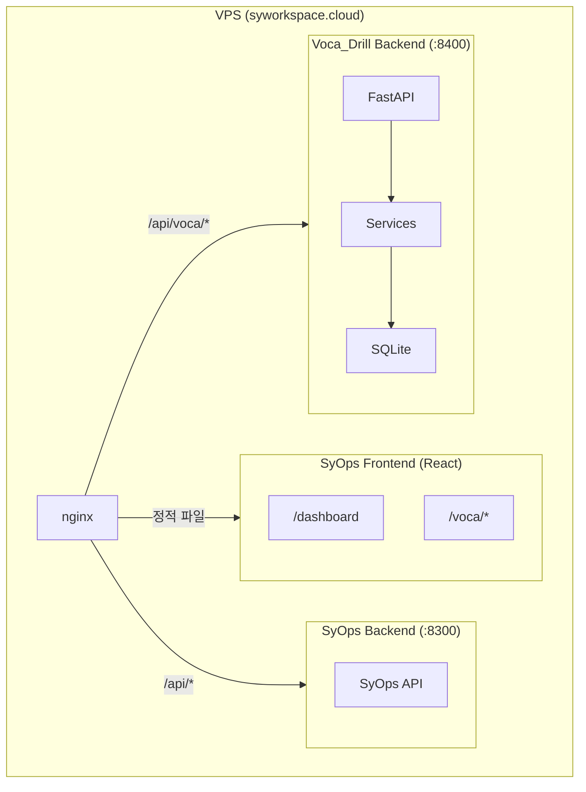

# Voca_Drill 개발 계획

## 프로젝트 개요

공인영어시험(TOEFL/TOEIC) 단어 학습 프로그램.
학습자의 인지 특성(ADHD 경향성, 동기 부여 필요성)을 고려하여 과학적 복습 체계와 컨텍스트 기반 학습을 결합한다.

- **목적**: 실제 사용할 영단어 학습 도구 (2-3명 사용)
- **타겟**: TOEFL/TOEIC 범용 (단어장 추가로 확장 가능)
- **1차 데이터**: 토플 '초록이' 교재
- **UX**: 카드 플립 자기 평가 + 다차원 퀴즈, 모바일 퍼스트
- **개발 순서**: 데이터 확보/분석 → 서비스 로직 구현 → FastAPI → SyOps React UI → VPS 배포

## 핵심 설계 결정

| 항목 | 결정 | 이유 |
|------|------|------|
| 복습 알고리즘 | SM-2 + 라이트너 하이브리드 | SM-2의 정교한 간격 계산 + 라이트너의 직관적 단계 표시 |
| 평가 스케일 | 4단계 (모름/헷갈림/알겠음/완벽) | 모바일 엄지 조작에 4버튼 적당 |
| 퀴즈 유형 | 다차원 (카드 플립→객관식→역방향→타이핑) | 숙련도에 따라 난이도 자동 상승 |
| 데이터 소스 | OCR 스캔 + NotebookLM 연동 | 교재 데이터 + 영영 풀이/예문/유의어 그룹 |
| DB | SQLAlchemy + SQLite | 로컬 경량, Phase 2에서도 그대로 사용 |
| DB 설계 | 데이터 확보 후 확정 | 단어장마다 데이터 형태가 다름, 실데이터 기반 설계 |
| 프론트엔드 | SyOps React 내 `/voca` 페이지 | 기존 인프라 활용, 모바일 퍼스트 |
| 백엔드 | FastAPI 독립 서비스 (포트 8400) | SyOps와 분리된 서비스 |
| 인증 | SyOps JWT 공유 | 동일 JWT_SECRET |
| CLI | import/관리용 최소한만 | 학습 세션은 웹 UI에서 직접 구현 |

---

## 초록이 교재 분석

### 학습 방식의 핵심: 영어 동의어 암기

초록이는 일반적인 영한 단어장과 다르다. **한국어 뜻을 외우는 것이 아니라 영어 동의어/유의어로 암기**하도록 설계된 책이다.

이것은 토플 시험의 특성과 직결된다:
- 토플 Reading에서 "Which of the following is closest in meaning to X?"처럼 **영어 동의어를 묻는 문제**가 핵심 출제 유형
- 따라서 prominent = noticeable, conspicuous, outstanding, remarkable 이런 식으로 **영어 동의어 세트를 통째로 익히는 것**이 학습의 본질

이 점은 학습 시스템과 퀴즈 설계에 근본적으로 영향을 준다:
- 카드 앞면: 영어 단어
- 카드 뒷면: **영어 동의어 목록이 중심**, 한국어 뜻은 보조
- 퀴즈: 영어 동의어 선택 문제가 핵심 퀴즈 유형이 되어야 함
- 역방향: 동의어를 보고 원래 단어를 맞히는 것도 중요

### 데이터 구조 (교재 페이지 분석)

실제 초록이 페이지에서 추출한 데이터 구조:

```
단어 4: prominent ★★★
├── 발음: [prɑ́mənənt]
├── 파생어: adv. prominently, n. prominence
├── 뜻 1
│   ├── 품사: adj
│   ├── 영어 동의어: noticeable, conspicuous, outstanding, remarkable
│   ├── 한국어: 눈에 띄는
│   └── 예문: Mt. Fuji is a prominent natural landmark in Japan.
└── 뜻 2
    ├── 품사: adj
    ├── 영어 동의어: important, leading, notable
    ├── 한국어: 중요한
    └── 예문: William Shakespeare is one of the most prominent figures...

단어 5: replenish ★★★
├── 발음: [riplέniʃ]
├── 뜻 1
│   ├── 품사: v
│   ├── 영어 동의어: refill, restore, renew
│   ├── 한국어: 보충하다
│   └── 예문: The travelers replenished their supplies of water...
└── 최신출제 포인트: renew가 '보충하다' 뜻일 때 replenish의 동의어가 될 수 있다
```

### 데이터 구조에서 파악된 필드

**단어(Word) 레벨:**
- 영어 단어 (english)
- 발음 기호 (pronunciation)
- 중요도/빈출도 (★ 개수)
- 파생어 목록 (derivatives)
- 교재 내 순서 (word_order)
- 교재 챕터 (chapter — Day 1, Day 2...)
- 최신출제 포인트 (exam_tip — 일부 단어만)

**뜻(Meaning) 레벨 — 한 단어에 여러 뜻 가능:**
- 뜻 순서 (meaning_order)
- 품사 (part_of_speech)
- **영어 동의어 목록** (synonyms — 이것이 핵심 학습 대상)
- 한국어 뜻 (korean — 보조)
- 예문 (example)

### 핵심 구조적 특징

1. **1단어 N뜻**: prominent처럼 한 단어가 여러 뜻을 가지며, 뜻마다 다른 동의어 세트와 예문이 붙음
2. **동의어가 뜻에 종속**: "눈에 띄는"의 동의어와 "중요한"의 동의어가 다름
3. **영어 동의어가 1차 학습 대상**: 한국어 뜻은 이해를 돕는 보조 역할

### 다른 단어장과의 차이

단어장마다 OCR 데이터 형태가 다르다:
- **초록이**: 풀 데이터 (발음, 파생어, 다의어, 동의어 세트, 예문, 출제 포인트)
- **다른 TOEFL/TOEIC 단어장**: 더 단순할 수 있음 (영어-한국어만, 동의어 없음 등)

→ DB 스키마는 초록이의 풀 데이터를 수용하되, 다른 단어장은 최소 필드(english, korean)만으로도 import 가능하게 설계해야 함.

### DB 구조 검토 방향: Word + WordMeaning 분리

현재 Word 테이블 1행 = 뜻 1개 구조로는 초록이 데이터를 정확히 담을 수 없다.
검토 중인 구조:

- **Word 테이블**: 단어 단위 (english, pronunciation, importance, derivatives, chapter...)
- **WordMeaning 테이블**: 뜻 단위 (word_id FK, part_of_speech, korean, synonyms, example...)
- 학습 진도(WordProgress)는 Word 단위로 관리

**→ 이 구조는 실제 OCR + NotebookLM 데이터를 확보한 후에 확정한다.** 데이터를 보면서 필요한 필드, 관계, 예외 케이스를 파악한 뒤 스키마를 잡는 것이 안전하다.

---

## 데이터 확보 계획

### Step 0: 데이터 확보 및 분석 (구현 전 선행)

1. **OCR 스캔**: 초록이 교재 전체 또는 일부를 OCR
2. **NotebookLM 분석**: OCR 데이터를 NotebookLM에 넣어 영영 풀이, 추가 예문, 유의어/반의어 그룹 등 추출
3. **데이터 정제**: OCR + NotebookLM 결과를 JSON 형태로 병합/정제
4. **DB 스키마 확정**: 실데이터 기반으로 테이블 구조, 필드, 관계 확정
5. **Import 파서 설계**: 초록이용 파서 구현, 추후 다른 단어장용 파서 추가 가능하도록

### Import JSON 형식 (초록이 기준 — 초안)

```json
{
  "english": "prominent",
  "pronunciation": "prɑ́mənənt",
  "importance": 3,
  "derivatives": ["adv. prominently", "n. prominence"],
  "chapter": "Day 1",
  "word_order": 4,
  "exam_type": "toefl",
  "exam_tip": null,
  "meanings": [
    {
      "order": 1,
      "part_of_speech": "adj",
      "korean": "눈에 띄는",
      "synonyms": ["noticeable", "conspicuous", "outstanding", "remarkable"],
      "example": "Mt. Fuji is a prominent natural landmark in Japan."
    },
    {
      "order": 2,
      "part_of_speech": "adj",
      "korean": "중요한",
      "synonyms": ["important", "leading", "notable"],
      "example": "William Shakespeare is one of the most prominent figures..."
    }
  ]
}
```

→ 이 형식도 실데이터 확보 후 조정될 수 있음.

---

## 학습 시스템 설계

### A. 복습 알고리즘: SM-2 + 라이트너 하이브리드

**SM-2 (메인 엔진)**: 에빙하우스 망각 곡선 기반. 개별 단어마다 ease_factor로 복습 간격을 동적 계산.

**4단계 피드백 → SM-2 매핑:**

| 버튼 | 의미 | SM-2 quality | 간격 변화 |
|------|------|-------------|-----------|
| 모름 | 전혀 안 떠오름 | 0-1 | 리셋 + 세션 내 재출제 |
| 헷갈림 | 겨우 떠올림 | 2-3 | 유지 또는 약간 증가 |
| 알겠음 | 자연스럽게 떠올림 | 4 | 정상 증가 |
| 완벽 | 즉시 떠올림, 너무 쉬움 | 5 | 대폭 증가 |

**라이트너 단계 (UI 표시용)**: SM-2의 interval에서 파생하여 5단계 시각화.

| Level | 이름 | 조건 | 색상 |
|-------|------|------|------|
| 1 | New | 학습 전 | ⬜ 회색 |
| 2 | Learning | interval < 3일 | 🟥 빨강 |
| 3 | Review | interval 3~7일 | 🟧 주황 |
| 4 | Familiar | interval 7~30일 | 🟨 노랑 |
| 5 | Mastered | interval > 30일 | 🟩 초록 |

### B. 다차원 인출 퀴즈 (숙련도 연동)

숙련도(Level)가 오르면 자동으로 더 어려운 퀴즈 유형이 해금.
**초록이의 영어 동의어 중심 학습을 반영한 퀴즈 설계:**

- **Level 1-2**: 카드 플립 (영어 단어 → 영어 동의어 + 한국어 뜻 확인, 자기 평가)
- **Level 3**: 객관식 — 영어 동의어를 보고 원래 단어 선택 (토플 Synonym 문제 직접 대비)
- **Level 4**: 역방향 — 영영 풀이를 보고 영어 단어 맞히기
- **Level 5**: 타이핑 — 동의어/뜻을 보고 영어 단어 직접 입력

### C. 세션 구성

- **세션 크기**: 기본 10~15개 (모바일 자투리 시간, 2~5분 완료)
- **구성 비율**: 복습 대상 60~70% + 새 단어 30~40%
- **일일 새 단어 상한**: config에서 설정 (기본 15개, 복습 폭탄 방지)
- **세션 내 재출제**: '모름' 단어는 세션 끝에 다시 출제, 전부 통과할 때까지
- **세션 중단**: 중간에 나가도 진행 상태 자동 저장, 이어하기 가능

### D. 컨텍스트 기반 강화 학습

- **동의어 세트 학습**: 관련 동의어를 묶어 노출, 토플 Synonym 문제 유형 대비
- **예문 노출**: 교재 내 실제 예문 + NotebookLM 추출 예문
- **최신출제 포인트**: exam_tip이 있는 단어는 학습 시 추가 표시

## UX 및 동기부여

### 모바일 퍼스트 설계

- 화면 전체를 카드 하나가 차지 (풀스크린 카드 UI)
- 탭으로 카드 플립, 하단 Thumb Zone에 평가 버튼 4개 배치
- 상단: 진행 바 (3/15) + 세션 정보
- 세션 중간 이탈 시 진행 상태 자동 저장
- PWA 지원 (홈화면 추가 시 앱처럼 동작)

### 카드 UI 설계 (초록이 반영)

- **카드 앞면**: 영어 단어 + 품사 + 발음 (크게)
- **카드 뒷면**: 영어 동의어 목록 (크게, 핵심) + 한국어 뜻 (보조) + 예문

### ADHD 친화적 설계

- **짧은 세션**: 10~15개 단위, 2~5분 완료
- **즉각적 피드백**: 플립 즉시 정답 확인
- **가변적 목표**: 매일 컨디션에 따라 최소 p개 ~ 최대 q개 유연 조절
- **시각적 보상**: 콤보 시스템, 목표 달성 시 시각 효과

### 게이미피케이션

- **콤보 카운터**: 연속 정답 시 콤보 수 표시
- **일일 스트릭**: 연속 학습 일수 추적
- **레벨업 알림**: 단어가 상위 Level로 올라갈 때 시각적 피드백
- **진도 시각화**: 전체 단어 대비 각 Level 분포 차트
- **목표 달성 보상**: 불꽃놀이 효과 등 도파민 자극 요소

## 아키텍처



## 레포별 역할

- **Voca_Drill**: 백엔드 전체 (FastAPI + Services + Data) + CLI (import/관리)
- **SyOps**: 프론트엔드 (`/voca` 페이지/컴포넌트) + nginx/배포 설정

## 인증 연동

- SyOps와 Voca_Drill이 동일한 `JWT_SECRET` 환경변수 사용
- Voca_Drill FastAPI에 `require_auth` 미들웨어 (SyOps JWT 토큰 검증)
- 프론트엔드는 SyOps의 기존 `AuthContext` + `authFetch` 활용

---

## Phase별 개발 계획

### Phase 0: 데이터 확보 및 분석 (구현 전 선행)

코드 구현 전에 실데이터를 확보하고 DB 스키마를 확정한다.

1. 초록이 교재 OCR 스캔
2. NotebookLM에 넣어 분석 데이터 추출 (영영 풀이, 추가 예문, 유의어/반의어 등)
3. OCR + NotebookLM 결과를 JSON으로 정제
4. 실데이터 기반으로 DB 스키마 확정
5. Import JSON 형식 확정

### Phase 1: 핵심 로직 + 데이터 (Voca_Drill 레포)

서비스 레이어를 구현하고 테스트로 검증. CLI는 import/관리용 최소한만.

#### Step 1-1: Data Layer

- Phase 0에서 확정한 스키마로 ORM 모델 구현
- DB 초기화/마이그레이션 로직
- **검증**: DB 생성 + 테이블 + 샘플 데이터 insert 확인

#### Step 1-2: WordBank 서비스 + CLI import

- JSON import (초록이용 파서), 단어 CRUD
- CLI: `wordbank import`, `wordbank list`
- **검증**: import → list로 확인

#### Step 1-3: SM-2 Scheduler + DrillEngine

- SM-2 간격 반복 알고리즘 구현
- 4단계 피드백 처리 (quality → ease_factor/interval 계산)
- 라이트너 단계 파생 로직
- 세션 구성 (복습 + 새 단어 혼합, 세션 내 재출제)
- **검증**: pytest로 간격 계산, 세션 구성 검증

#### Step 1-4: 다차원 퀴즈 + 통계

- 퀴즈 유형별 로직 (카드 플립, 객관식, 역방향, 타이핑)
- Level별 퀴즈 유형 자동 선택
- 세션/일일/전체 통계 계산
- **검증**: 테스트로 퀴즈 생성/채점, 통계 계산 확인

### Phase 2: 웹 서비스 + 모바일 UI (양쪽 레포)

#### Step 2-1: FastAPI 서버 (Voca_Drill 레포)

- API 엔드포인트: 단어 조회, 세션 시작/제출, 복습 대상, 통계, 퀴즈
- JWT 인증 미들웨어
- **검증**: curl/httpie로 API 테스트

#### Step 2-2: React 프론트엔드 (SyOps 레포)

- 카드 플립 학습 세션 UI (모바일 퍼스트, Thumb Zone 레이아웃)
- 퀴즈 유형별 UI (객관식, 타이핑, 역방향)
- 학습 대시보드 (진도, Level 분포, 스트릭)
- 단어장 관리 (목록, 검색, JSON 업로드)
- 게이미피케이션 UI (콤보, 보상 효과)
- PWA manifest
- **검증**: 로컬 프론트+백엔드 연동, 모바일 실기기 테스트

### Phase 3: 배포 + 고도화

- VPS 서비스 등록 (포트 8400)
- nginx 프록시 설정 (`/api/voca/*`)
- SyOps 헬스체크 연동
- LLM 보조 (예문 생성, 어원 설명 — 배포 후 점진적 추가)
- 상세 통계 트렌드 차트

---

## 개발 순서 요약

```
Phase 0                Phase 1 (Voca_Drill)        Phase 2 (양쪽 레포)     Phase 3
데이터 확보             핵심 로직                    웹 서비스화              배포+고도화

OCR + NotebookLM       1-1 Data Layer              2-1 FastAPI + Auth      VPS 배포
     ↓                  ↓                            ↓                    nginx 설정
JSON 정제              1-2 WordBank + import        2-2 React 모바일 UI     헬스체크
     ↓                  ↓                                                  LLM 보조
DB 스키마 확정         1-3 SM-2 + DrillEngine
                        ↓
                       1-4 다차원 퀴즈 + 통계
```

## 주의 사항

- **데이터 선행**: Phase 0(데이터 확보)이 완료되어야 Phase 1 시작 가능
- **CLI 최소화**: 학습 세션 CLI는 만들지 않음. import/관리만 구현
- **크로스 레포 작업**: Phase 2-2는 SyOps 레포. 각 프로젝트를 단독으로 열어서 개발
- **모바일 테스트**: Phase 2-2에서 실기기 모바일 테스트 필수
- **단어장 확장**: 추후 TOEIC 등 다른 단어장 추가 시, 해당 단어장용 파서만 추가하면 됨
