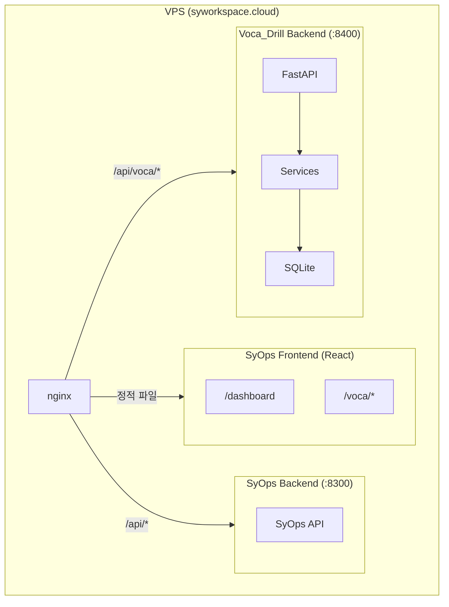

# Voca_Drill 개발 계획

## 결정 사항 요약

- **목적**: 실제 사용할 영단어 학습 도구 (2-3명 사용)
- **UX**: 카드 플립 (자기 평가), 모바일 퍼스트 반응형
- **개발 순서**: CLI로 핵심 로직 검증 -> FastAPI 래핑 -> SyOps 웹 UI -> VPS 배포
- **프론트엔드**: SyOps React 앱 내 `/voca` 경로에 페이지 추가 (SyOps 레포)
- **백엔드**: Voca_Drill 독립 FastAPI 서비스 (Voca_Drill 레포, 포트 8400)
- **인증**: SyOps JWT 공유 (동일 JWT_SECRET 사용)
- **배포**: VPS, nginx가 `/api/voca/*` 를 Voca_Drill 백엔드로 프록시
- **단어 데이터**: 사용자가 CSV/JSON으로 직접 확보 (당분간 샘플 데이터로 검증)
- **LLM**: 핵심 기능 완성 후 추가
- **SyOps 포털 리팩토링**: 이번 계획에서 보류

## 아키텍처



## 레포별 역할

- **Voca_Drill**: 백엔드 전체 (FastAPI + Services + Data) + CLI
- **SyOps**: 프론트엔드 (`/voca` 페이지/컴포넌트 추가) + nginx/배포 설정 + 헬스체크

## 인증 연동

- SyOps와 Voca_Drill이 동일한 `JWT_SECRET` 환경변수 사용
- Voca_Drill FastAPI에 `require_auth` 미들웨어 구현 (SyOps의 JWT 토큰 검증)
- 프론트엔드는 SyOps의 기존 `AuthContext` + `authFetch` 그대로 활용

---

## Phase 1: CLI 기반 핵심 로직 검증 (Voca_Drill 레포)

CLI로 각 서비스를 구현하고 **실행해서 동작을 확인**한 뒤 다음 Step으로 넘어간다.
단어 데이터가 아직 없으므로 **샘플 CSV(10~20개 단어)**를 만들어 검증한다.

### Step 1-1: Data Layer 확정

- `voca_drill/data/models.py` ORM 모델 검증/보완 (Word, LearningRecord, WordProgress)
- `voca_drill/data/database.py` 세션 관리 확정 (동기 유지, Phase 2에서 async 전환)
- DB 초기화 로직
- 검증용 샘플 CSV 작성 (TOEFL/TOEIC 각 10개)
- **검증**: DB 생성 + 테이블 확인

### Step 1-2: WordBank 서비스 + CLI import

- `voca_drill/services/wordbank.py` 구현: CSV/JSON import, 단어 CRUD, 그룹/태그 관리
- `voca_drill/cli.py`에 `wordbank` 서브커맨드: `import`, `list`, `stats`
- **검증**: `drill wordbank import sample.csv --type toefl` -> `drill wordbank list` 로 확인

### Step 1-3: DrillEngine + CLI drill 세션

- `voca_drill/services/drill.py`: 학습 세션 생성, 단어 선정, 결과 기록
- CLI에서 인터랙티브 퀴즈: 단어 표시 -> Enter로 뜻 공개 -> 자기 평가 입력
- **검증**: `drill start --count 5` 로 CLI 퀴즈 세션 진행, 결과 DB 저장 확인

### Step 1-4: SM-2 Scheduler

- `voca_drill/services/scheduler.py`: SM-2 간격 반복 알고리즘, 복습 대상 선정
- DrillEngine과 연동: 복습 대상 우선 출제
- **검증**: 학습 후 `drill review` 로 복습 대상 단어 확인, 간격 계산 검증

### Step 1-5: StatsTracker + CLI stats

- `voca_drill/services/stats.py`: 일일 통계, 전체 진도, 정답률
- CLI에서 Rich 테이블로 통계 출력
- **검증**: 여러 세션 진행 후 `drill stats`, `drill stats --today` 결과 확인

## Phase 2: 웹 서비스화 (양쪽 레포)

Phase 1에서 CLI로 검증된 서비스를 FastAPI로 래핑하고, SyOps React에 UI 추가.

### Step 2-1: FastAPI + Auth (Voca_Drill 레포)

- `api.py` 신규 생성: FastAPI 앱, 라우터 구성
- 엔드포인트: 단어 조회, 학습 세션 시작/제출, 복습 대상, 통계
- JWT 인증 미들웨어 (SyOps JWT_SECRET 공유)
- DB를 async로 전환 (aiosqlite)
- **검증**: httpie/curl로 API 호출 테스트

### Step 2-2: SyOps React 프론트엔드 (SyOps 레포)

- React Router에 `/voca/*` 경로 추가
- 카드 플립 학습 세션 UI (모바일 퍼스트, 터치 제스처)
- 단어장 관리 페이지 (목록, 검색, CSV 업로드)
- 학습 현황 대시보드 (오늘 학습량, 진도, 복습 예정)
- **검증**: 로컬에서 프론트+백엔드 연동 테스트

## Phase 3: VPS 배포 (양쪽 레포 + VPS)

- Voca_Drill 서비스 등록 (systemd/Docker, 포트 8400)
- `SyOps/deploy/nginx/services.conf`에 `/api/voca/` 프록시 블록 추가
- SyOps 헬스체크 연동 (health.py, systemd.py)
- SyOps 프론트엔드 빌드 재배포
- CI/CD 설정

## Phase 4: 고도화 (배포 후 반복)

- 상세 통계 + 트렌드 차트
- 오답/약점 집중 복습 세션
- 한->영 모드, 예문 빈칸 채우기
- LLM 보조 (예문 생성, 어원 설명, 유사어)
- 단어 마킹 (중요/숙지)

---

## 개발 순서 요약

```
Phase 1 (Voca_Drill 레포)     Phase 2 (양쪽 레포)      Phase 3         Phase 4
CLI로 핵심 로직 검증           웹 서비스화               VPS 배포        고도화
                                                                        
1-1 Data Layer                2-1 FastAPI + Auth        서비스 등록      통계 트렌드
 ↓                             ↓                       nginx 설정      복습 강화
1-2 WordBank + CLI import     2-2 SyOps React UI       헬스체크 연동    LLM 보조
 ↓                                                     CI/CD
1-3 DrillEngine + CLI drill
 ↓
1-4 SM-2 Scheduler
 ↓
1-5 StatsTracker + CLI stats
```

각 Step마다 **검증 항목을 통과**한 뒤 다음으로 넘어간다.
사용자가 실제 단어 데이터를 투입하는 시점은 자유 (Phase 1 중간이든 Phase 2 이후든).

## 주의 사항

- **크로스 레포 작업**: Phase 2-2는 SyOps 레포에서 작업. 워크스페이스 모드에서는 운영만 하므로, 코드 개발은 해당 프로젝트를 단독으로 열어서 진행
- **기존 설계 문서 갱신**: Phase 1 시작 시 `docs/features.md`, `docs/architecture.md`를 현재 계획에 맞게 갱신
- **async 전환 시점**: Phase 1은 동기 SQLite로 CLI 검증. Phase 2-1에서 FastAPI 도입 시 async 전환
