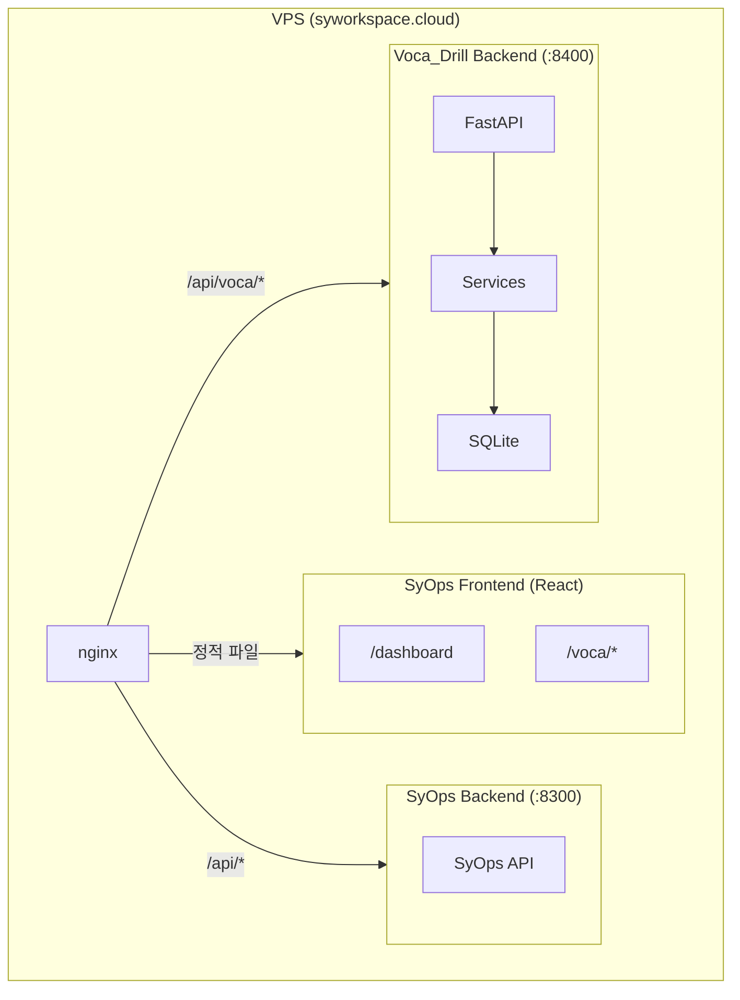

# Voca_Drill 개발 계획

## 프로젝트 개요

공인영어시험(TOEFL/TOEIC) 단어 학습 프로그램.
학습자의 인지 특성(ADHD 경향성, 동기 부여 필요성)을 고려하여 과학적 복습 체계와 컨텍스트 기반 학습을 결합한다.

- **목적**: 실제 사용할 영단어 학습 도구 (2-3명 사용)
- **타겟**: TOEFL/TOEIC 범용 (단어장 추가로 확장 가능)
- **1차 데이터**: 토플 '초록이' 교재 (30 Days × ~56단어 ≈ **1,680단어**)
- **UX**: 카드 플립 자기 평가 + 다차원 퀴즈, 모바일 퍼스트
- **개발 순서**: 데이터 확보/분석 → 서비스 로직 구현 → FastAPI → SyOps React UI → VPS 배포

## 핵심 설계 결정

| 항목 | 결정 | 이유 |
|------|------|------|
| 복습 알고리즘 | SM-2 + 라이트너 하이브리드 | SM-2의 정교한 간격 계산 + 라이트너의 직관적 단계 표시 |
| 평가 스케일 | 4단계 (모름/헷갈림/알겠음/완벽) | 모바일 엄지 조작에 4버튼 적당 |
| 퀴즈 유형 | 다차원 (카드 플립→객관식→역방향→타이핑) | 숙련도에 따라 난이도 자동 상승 |
| 데이터 소스 | 스캔 PDF → AI(Claude/GPT-4o)로 JSON 추출 | Day 단위 분할, 기출/중요동의어 구분 추출 |
| DB | SQLAlchemy + SQLite | 로컬 경량, Phase 2에서도 그대로 사용 |
| DB 설계 | 교재 분석 기반 확정 | Word + WordMeaning 분리, 기출/중요동의어 구분 |
| 프론트엔드 | SyOps React 내 `/voca` 페이지 | 기존 인프라 활용, 모바일 퍼스트 |
| 백엔드 | FastAPI 독립 서비스 (포트 8400) | SyOps와 분리된 서비스 |
| 인증 | SyOps JWT 공유 | 동일 JWT_SECRET |
| CLI | import/관리용 최소한만 | 학습 세션은 웹 UI에서 직접 구현 |

---

## 초록이 교재 분석 (완료)

> 상세 분석: `docs/bookpdf/hackers_voca_analysis.md`

### 학습 방식의 핵심: 영어 동의어 암기

초록이는 일반적인 영한 단어장과 다르다. **한국어 뜻을 외우는 것이 아니라 영어 동의어/유의어로 암기**하도록 설계된 책이다. 토플 Reading의 "Which of the following is closest in meaning to X?" 문제 유형에 직결.

### 교재 데이터 구조 (6가지 구성 요소)

| # | 구성 요소 | 설명 |
|---|----------|------|
| ① | 표제어 | 기출 단어, 출제빈도 ★1~3, Day 내 빈도순 배치 |
| ② | **기출동의어** | 시험에서 **정답으로 출제된** 동의어 (녹색 강조) — 최우선 암기 |
| ③ | **중요동의어** | 출제 가능성 높은 동의어 (일반 표기) — 확장 학습 |
| ④ | 기출파생어 | 시험에 출제된 파생어 |
| ⑤ | 예문 + 해석 | 영어 예문(본문) + 한국어 해석(페이지 하단 별도) |
| ⑥ | 최신출제 포인트 | 추가 의미, 혼동어, 관련 동의어 팁 (선별적) |

### 핵심 수치

- **총 단어**: ~1,680개 (30 Days × ~56개/Day)
- **각 Day**: 10페이지 (단어 9p + Quiz 1p)
- **빈도 분포**: Day 내 ★★★ → ★★ → ★ 순서 배치
- **다의어**: 한 단어에 여러 뜻, 뜻마다 다른 동의어 세트 + 예문

### 기출동의어 vs 중요동의어

이 구분이 학습 프로그램에 핵심적:
- **기출동의어**: 실제 시험 정답 → 최우선 학습
- **중요동의어**: 출제 가능성 높음 → 숙련도 상승 후 확장

### 카드 UI 반영

- **카드 앞면**: 영어 단어 + 품사 + 발음
- **카드 뒷면**: 기출동의어 (크게) + 중요동의어 + 한국어 뜻 (보조) + 예문

---

## 데이터 추출 계획

> 상세: `docs/data-extraction.md`

### Phase 0: 데이터 추출 (스캔 PDF → JSON)

1. ✅ 교재 분석 완료 (Day 01~05 상세 분석, 구조 파악)
2. **PDF를 Day 단위(10p)로 분할** (30청크, 스크립트 자동화)
3. **Day별 AI 추출** (Claude/GPT-4o에 PDF + 프롬프트 입력)
4. **검증 + Import** (자동 스크립트 + 스팟 체크)

### Import JSON 형식 (확정)

```json
{
  "day": "Day 01",
  "words": [
    {
      "word_order": 1,
      "english": "exploit",
      "pronunciation": "[iksplɔ́it]",
      "frequency": 3,
      "derivatives": [{"pos": "n.", "word": "exploitation"}],
      "exam_tip": "exploit는 동사가 아닌 명사로도 많이 쓰인다...",
      "ocr_note": null,
      "meanings": [
        {
          "order": 1,
          "part_of_speech": "v.",
          "korean": "(부당하게) 이용하다",
          "tested_synonyms": ["utilize", "use", "make use of", "take advantage of"],
          "important_synonyms": [],
          "example_en": "Human rights activists have led protests...",
          "example_ko": "인권 운동가들은 아동의 노동을 이용하는 회사들에..."
        }
      ]
    }
  ],
  "quiz": { ... }
}
```

---

## 학습 시스템 설계

### A. 복습 알고리즘: SM-2 + 라이트너 하이브리드

**SM-2 (메인 엔진)**: 에빙하우스 망각 곡선 기반. 개별 단어마다 ease_factor로 복습 간격을 동적 계산.

**4단계 피드백 → SM-2 매핑:**

| 버튼 | 의미 | SM-2 quality | 간격 변화 |
|------|------|-------------|-----------|
| 모름 | 전혀 안 떠오름 | 0-1 | 리셋 + 세션 내 재출제 |
| 헷갈림 | 겨우 떠올림 | 2-3 | 유지 또는 약간 증가 |
| 알겠음 | 자연스럽게 떠올림 | 4 | 정상 증가 |
| 완벽 | 즉시 떠올림, 너무 쉬움 | 5 | 대폭 증가 |

**라이트너 단계 (UI 표시용)**: SM-2의 interval에서 파생하여 5단계 시각화.

| Level | 이름 | 조건 | 색상 |
|-------|------|------|------|
| 1 | New | 학습 전 | ⬜ 회색 |
| 2 | Learning | interval < 3일 | 🟥 빨강 |
| 3 | Review | interval 3~7일 | 🟧 주황 |
| 4 | Familiar | interval 7~30일 | 🟨 노랑 |
| 5 | Mastered | interval > 30일 | 🟩 초록 |

### B. 다차원 인출 퀴즈 (숙련도 연동)

숙련도(Level)가 오르면 자동으로 더 어려운 퀴즈 유형이 해금.
**초록이의 영어 동의어 중심 학습을 반영한 퀴즈 설계:**

- **Level 1-2**: 카드 플립 (영어 단어 → 영어 동의어 + 한국어 뜻 확인, 자기 평가)
- **Level 3**: 객관식 — 영어 동의어를 보고 원래 단어 선택 (토플 Synonym 문제 직접 대비)
- **Level 4**: 역방향 — 영영 풀이를 보고 영어 단어 맞히기
- **Level 5**: 타이핑 — 동의어/뜻을 보고 영어 단어 직접 입력

### C. 세션 구성

- **세션 크기**: 기본 10~15개 (모바일 자투리 시간, 2~5분 완료)
- **구성 비율**: 복습 대상 60~70% + 새 단어 30~40%
- **일일 새 단어 상한**: config에서 설정 (기본 15개, 복습 폭탄 방지)
- **세션 내 재출제**: '모름' 단어는 세션 끝에 다시 출제, 전부 통과할 때까지
- **세션 중단**: 중간에 나가도 진행 상태 자동 저장, 이어하기 가능

### D. 컨텍스트 기반 강화 학습

- **동의어 세트 학습**: 관련 동의어를 묶어 노출, 토플 Synonym 문제 유형 대비
- **예문 노출**: 교재 내 실제 예문 + NotebookLM 추출 예문
- **최신출제 포인트**: exam_tip이 있는 단어는 학습 시 추가 표시

## UX 및 동기부여

### 모바일 퍼스트 설계

- 화면 전체를 카드 하나가 차지 (풀스크린 카드 UI)
- 탭으로 카드 플립, 하단 Thumb Zone에 평가 버튼 4개 배치
- 상단: 진행 바 (3/15) + 세션 정보
- 세션 중간 이탈 시 진행 상태 자동 저장
- PWA 지원 (홈화면 추가 시 앱처럼 동작)

### 카드 UI 설계 (초록이 반영)

- **카드 앞면**: 영어 단어 + 품사 + 발음 (크게)
- **카드 뒷면**: 영어 동의어 목록 (크게, 핵심) + 한국어 뜻 (보조) + 예문

### ADHD 친화적 설계

- **짧은 세션**: 10~15개 단위, 2~5분 완료
- **즉각적 피드백**: 플립 즉시 정답 확인
- **가변적 목표**: 매일 컨디션에 따라 최소 p개 ~ 최대 q개 유연 조절
- **시각적 보상**: 콤보 시스템, 목표 달성 시 시각 효과

### 게이미피케이션

- **콤보 카운터**: 연속 정답 시 콤보 수 표시
- **일일 스트릭**: 연속 학습 일수 추적
- **레벨업 알림**: 단어가 상위 Level로 올라갈 때 시각적 피드백
- **진도 시각화**: 전체 단어 대비 각 Level 분포 차트
- **목표 달성 보상**: 불꽃놀이 효과 등 도파민 자극 요소

## 아키텍처



## 레포별 역할

- **Voca_Drill**: 백엔드 전체 (FastAPI + Services + Data) + CLI (import/관리)
- **SyOps**: 프론트엔드 (`/voca` 페이지/컴포넌트) + nginx/배포 설정

## 인증 연동

- SyOps와 Voca_Drill이 동일한 `JWT_SECRET` 환경변수 사용
- Voca_Drill FastAPI에 `require_auth` 미들웨어 (SyOps JWT 토큰 검증)
- 프론트엔드는 SyOps의 기존 `AuthContext` + `authFetch` 활용

---

## Phase별 개발 계획

### Phase 0: 데이터 추출 (스캔 PDF → JSON → DB)

1. ✅ 교재 분석 완료
2. PDF Day 단위 분할 (30청크 × 10p)
3. AI로 Day별 JSON 추출 (단어 + Quiz)
4. Review TEST / Final TEST 추출
5. 검증 + CLI import

### Phase 1: 핵심 로직 + 데이터 (Voca_Drill 레포)

서비스 레이어를 구현하고 테스트로 검증. CLI는 import/관리용 최소한만.

#### Step 1-1: Data Layer

- Phase 0에서 확정한 스키마로 ORM 모델 구현
- DB 초기화/마이그레이션 로직
- **검증**: DB 생성 + 테이블 + 샘플 데이터 insert 확인

#### Step 1-2: WordBank 서비스 + CLI import

- JSON import (초록이용 파서), 단어 CRUD
- CLI: `wordbank import`, `wordbank list`
- **검증**: import → list로 확인

#### Step 1-3: SM-2 Scheduler + DrillEngine

- SM-2 간격 반복 알고리즘 구현
- 4단계 피드백 처리 (quality → ease_factor/interval 계산)
- 라이트너 단계 파생 로직
- 세션 구성 (복습 + 새 단어 혼합, 세션 내 재출제)
- **검증**: pytest로 간격 계산, 세션 구성 검증

#### Step 1-4: 다차원 퀴즈 + 통계

- 퀴즈 유형별 로직 (카드 플립, 객관식, 역방향, 타이핑)
- Level별 퀴즈 유형 자동 선택
- 세션/일일/전체 통계 계산
- **검증**: 테스트로 퀴즈 생성/채점, 통계 계산 확인

### Phase 2: 웹 서비스 + 모바일 UI (양쪽 레포)

#### Step 2-1: FastAPI 서버 (Voca_Drill 레포)

- API 엔드포인트: 단어 조회, 세션 시작/제출, 복습 대상, 통계, 퀴즈
- JWT 인증 미들웨어
- **검증**: curl/httpie로 API 테스트

#### Step 2-2: React 프론트엔드 (SyOps 레포)

- 카드 플립 학습 세션 UI (모바일 퍼스트, Thumb Zone 레이아웃)
- 퀴즈 유형별 UI (객관식, 타이핑, 역방향)
- 학습 대시보드 (진도, Level 분포, 스트릭)
- 단어장 관리 (목록, 검색, JSON 업로드)
- 게이미피케이션 UI (콤보, 보상 효과)
- PWA manifest
- **검증**: 로컬 프론트+백엔드 연동, 모바일 실기기 테스트

### Phase 3: 배포 + 고도화

- VPS 서비스 등록 (포트 8400)
- nginx 프록시 설정 (`/api/voca/*`)
- SyOps 헬스체크 연동
- LLM 보조 (예문 생성, 어원 설명 — 배포 후 점진적 추가)
- 상세 통계 트렌드 차트

---

## 개발 순서 요약

```
Phase 0                Phase 1 (Voca_Drill)        Phase 2 (양쪽 레포)     Phase 3
데이터 추출             핵심 로직 (완료)             웹 서비스화              배포+고도화

PDF 분할 (30Day)       1-1 Data Layer ✅            2-1 FastAPI + Auth      VPS 배포
     ↓                 1-2 WordBank ✅               ↓                    nginx 설정
AI JSON 추출           1-3 SM-2 + Drill ✅         2-2 React 모바일 UI     헬스체크
     ↓                 1-4 퀴즈 + 통계 ✅                                   LLM 보조
검증 + import
```

## 주의 사항

- **Phase 1 완료**: 코드 구현은 끝남. Phase 0(데이터 추출)과 Phase 2를 병행 가능
- **CLI 최소화**: 학습 세션 CLI는 만들지 않음. import/관리만 구현
- **크로스 레포 작업**: Phase 2-2는 SyOps 레포. 각 프로젝트를 단독으로 열어서 개발
- **모바일 테스트**: Phase 2-2에서 실기기 모바일 테스트 필수
- **단어장 확장**: 추후 TOEIC 등 다른 단어장 추가 시, 해당 단어장용 파서만 추가하면 됨
